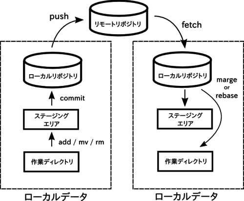

Git 使用手順書
================================================================================

バージョン管理システム
--------------------------------------------------------------------------------
Gitの説明の前にバージョン管理システムについて簡単に説明します。

バージョン管理システムとは、
ファイル群の編集履歴を管理するシステムです。
変更時刻や編集前との差分を記録することで、
過去の状態との比較やバックアップを支援してくれます。

以下はバージョン管理システム関連の基本的な用語です。

### リポジトリ
上述の編集履歴を保存してあるディレクトリのことです。

このリポジトリが1つだけ存在する場合を集中型バージョン管理システム、
複数あるタイプを分散型バージョン管理システムといいます。

 * リモートリポジトリ: 外部のサーバ上などにあるリポジトリ
 * ローカルリポジトリ: 編集しているファイルと同じコンピュータ上にあるリポジトリ

### チェックアウト
リポジトリから作業領域にデータを取り出すことです。
過去の状態を復元する操作と言えます。

### コミット (チェックイン)
リポジトリに編集履歴を追加することです。
最新版をアップロードする操作と言えます。

**バージョン管理システムにおける編集履歴の最小単位は、このコミットという操作です。**


Git と GitHub
--------------------------------------------------------------------------------
### Git
Gitは、とてもよく使われている分散型バージョン管理システムのひとつで、
リモートリポジトリの他にローカルにもリポジトリがあります。
基本的にローカルリポジトリでバージョン管理を行うのが特徴です。

### GitHub
GitHubはGitのリモートリポジトリを簡単に設置させてくれるWebサービス。
リポジトリの中身を全て公開する場合は無料ですが、
非公開にする場合は有料です。


Gitの導入
--------------------------------------------------------------------------------
調べればすぐ見つかると思いますが、
例えばubuntuなら
```sh
	sudo apt-get install git
```
で簡単にインストールできます。


わかりやすい解説ページ
--------------------------------------------------------------------------------
Gitの入門としてはまず
[サルでもわかるGit入門](http://www.backlog.jp/git-guide/)
を(別に理解しきらなくてもいいので)一度読んでから
<iframe src="http://www.slideshare.net/slideshow/embed_code/key/7IDVMiiin2fCMx" width="425" height="355" frameborder="0" marginwidth="0" marginheight="0" scrolling="no" style="border:1px solid #CCC; border-width:1px; margin-bottom:5px; max-width: 100%;" allowfullscreen> </iframe> <div style="margin-bottom:5px"> <strong> <a href="http://www.slideshare.net/matsukaz/git-28304397" title="いつやるの？Git入門 v1.1.0" target="_blank">いつやるの？Git入門 v1.1.0</a> </strong> from <strong><a href="http://www.slideshare.net/matsukaz" target="_blank">Masakazu Matsushita</a></strong> </div>
や
<iframe src="http://www.slideshare.net/slideshow/embed_code/key/us6QLyLgaRMCyy" width="425" height="355" frameborder="0" marginwidth="0" marginheight="0" scrolling="no" style="border:1px solid #CCC; border-width:1px; margin-bottom:5px; max-width: 100%;" allowfullscreen> </iframe> <div style="margin-bottom:5px"> <strong> <a href="http://www.slideshare.net/kotas/git-15276118" title="こわくない Git" target="_blank">こわくない Git</a> </strong> from <strong><a href="http://www.slideshare.net/kotas" target="_blank">Kota Saito</a></strong> </div>
を見るとわかりやすいと思います。


Gitの全体構成
--------------------------------------------------------------------------------


### 作業ディレクトリ (ワーキングツリー)
普通のディレクトリです。ファイルの編集そのものはここで行います。
Gitで管理するファイルは全てこのディレクトリ下に置いていくことになります。

### ステージングエリア (インデックス)
次のcommitで編集履歴を更新する予定のファイルを乗せておく
(ステージングする) ところです。

### ローカルリポジトリ
簡単にいうと作業ディレクトリと同じコンピュータ上にあるリポジトリです。
ローカルリポジトリの中で作業しているぶんには他人からは見えません。
なので、ここまでは多少ミスしても復旧しやすく周りに迷惑かけることはありません。

### リモートリポジトリ
GitHubなど外部のコンピュータ上に置いてあるリポジトリです。
共同開発者との共有物なので慎重に作業する必要があります。


Gitのコマンドまとめ (初期設定)
--------------------------------------------------------------------------------

|コマンド    |意味                                                   |
|:-----------|:------------------------------------------------------|
| git init   | カレントディレクトリをGit管理下におく                 |
| git clone  | リモートリポジトリのデータをダウンロードする          |

### > git init
カレントディレクトリを作業ディレクトリとして登録します。
具体的には、ステージングエリアやローカルリポジトリのデータを
保存・管理するための「.git」ディレクトリがカレントディレクトリに生成されます。

### > git clone "リモートリポジトリのURI"
すでに存在するリモートリポジトリの内容をダウンロードして
新しいディレクトリを作るコマンドです。
このディレクトリはそのままGit管理下の作業用ディレクトリとして使うことができます。

実際のところ

1. GitHubに新規リモートリポジトリ作成
2. git cloneでローカルリポジトリ作成
3. 作業開始

の流れが楽なので`git init`よりこちらを使う機会の方が多いと思います。


Gitのコマンドまとめ (ステージング関連)
--------------------------------------------------------------------------------

|コマンド    |意味                                                   |
|:-----------|:------------------------------------------------------|
|git add     |指定したファイルをGit管理下におく                      |
|git rm      |Git管理下のファイルを削除しそれをステージに記録        |
|git mv      |Git管理下のファイルのファイル名を変更しステージに記録  |
|git status  |ステージの状況を表示                                   |

### > git add "ファイル名"
指定したファイルをGit管理下におき、ステージングエリアに追加します。
ファイル名はスペース区切りで複数指定可能です。
```sh
	git add a.txt b.txt c.txt
```

「--all」オプションつけると前回のcommit以降編集された全てのファイルがステージされます。
(ファイルの新規作成や削除も含む)
```sh
	git add --all
```


### > git rm "ファイル名"
普通の`rm`コマンドと同じ感覚で使います。
指定したファイルを**作業ディレクトリから削除**し、
そのことをステージングエリアに記録します。

ディレクトリごと削除するときは「-r」オプションを付けます。
```sh
	git rm -r dir/
```

Git管理下から外したいけどファイルは削除したくない、といった場合は
「--cached」オプションを付けます。
```sh
	git rm --cached file.txt
```

### > git mv "ファイル名"
`git rm```同様, 普通の```mv`コマンドと同じ感覚で使います。
ファイル名の変更がステージエリアに記録されます。

### > git status
* 編集されたファイル
* 新規作成されたファイル
* 削除されたファイル

の名前が一覧で出力されます。


Gitのコマンドまとめ (コミット・ブランチ)
--------------------------------------------------------------------------------

|コマンド    |意味                                                   |
|:-----------|:------------------------------------------------------|
|git commit  |ステージングエリアの情報をローカルリポジトリに追記     |
|git checkout|作業するブランチの切り替え                             |
|git log     |コミットログを出力                                     |
|git fetch   |リモートリポジトリの最新の状態をローカルに保存する     |
|git merge   |別のブランチと統合する                                 |
|git rebase  |ブランチの根本を別の位置に動かす                       |

### > git commit -m "コミットメッセージ"
ステージングエリアの情報をローカルリポジトリに記録します。

「--amend」オプションをつけると直前のコミットを置き換えられます。
```sh
	git commit --amend -m "コミットメッセージ"
```

### > git checkout "ブランチ名"
作業ブランチを指定したブランチに切り替えます。

**ステージングエリアや作業ディレクトリも更新されるので注意してください。
コミットしていないデータは復元は困難です。**

### > git log
commitログを見るためのコマンドです。
「--graph --color」をオプションでつけると多少グラフィカルになります。
```sh
	git log --graph --color
```

### > git fetch
ローカルリポジトリ内にあるリモートリポジトリのキャッシュを最新にします。
`git merge`や`git rebase`を使うまで、
このコマンド単体では特に何もおきません。

### > git merge "ブランチ名 (正確にはコミットID)"
現在作業中のブランチに指定したブランチをマージします。
作業ディレクトリもそれに合わせて更新されます。
コミットIDを指定するとそのコミットまでの履歴とマージされます。


### > git rebase "ブランチ名 (正確にはコミットID)"
ログを操作するタイプのコマンドです。
現在作業中のブランチの根本を、指定したブランチの先頭に移動します。
作業ディレクトリもそれに合わせて更新されます。
コミットIDを指定するとそのコミットの位置に移動します。

### > git pull
色々と細かい違いはありますが、基本的には
`git fetch`と`git merge "作業中のブランチ"`が順に実行されます。

編集履歴の競合が発生しない場合は
```sh
	git add foo.txt bar.txt hoge.txt
	git commit -m "コミットメッセージ"
	git pull
	git push
```
が**Gitを使う上での基本的な流れ**になります。


Gitのコマンドまとめ (リカバリー)
--------------------------------------------------------------------------------

|コマンド    |意味                                                   |
|:-----------|:------------------------------------------------------|
|git reset   |指定したコミットが行われたときの状態に戻す             |
|git reflog  |HEADの移動の履歴を見ることができる                     |

### あのコミットの時点まで戻したい
```sh
	git reset "コミットID"
```
で HEAD位置、ステージングエリアの中身が復元されます。
例えば5つ前のコミットに戻したければ
```sh
	git reset HEAD~5
```
で復元できます。

「--soft」オプションをつけるとHEAD位置のみが、
「--hard」オプションをつけると作業ディレクトリの中身まで全部復元されます。

まだコミットしていないが`git add`は既にしてあるファイルを復元したいなら
```sh
	git checkout -- "ファイル名"
```
でステージングエリアから作業ディレクトリに取り出せます。
「--」は指定したファイル名がブランチ名でないことを明示するためのオプションで、
これが無いと指定したファイル名と同じ名前のブランチがあったとき誤動作します。

### mergeを取り消したい, reset --hard で戻りすぎた, など
`git reset`が使えるのは復元したいコミットIDが分かっている場合だけです。

なので
`git merge`や`git reset`などでHEADの位置が変わってしまって
復元したいコミットIDが分からなくなった場合は
非常に困るのですが、
こんなときは
```sh
	git reflog
```
で
```plain
	69bac54 HEAD@{1}: checkout: moving from master to develop
	715063a HEAD@{2}: checkout: moving from 69bac54c15d40a2159959ced9fe78660bcb15093 to master
	69bac54 HEAD@{3}: checkout: moving from master to origin/develop
	715063a HEAD@{4}: clone: from https://github.com/kzm4269/plen2__document
```
こんな感じに過去のHEADの位置の履歴を見ることができます。
「HEAD@{1}」とか「HEAD@{2}」とかが過去のHEADの位置です。

つまり
```sh
	git reset --hard HEAD@{1}
```
で1つ前の操作を取り消せます。
いざというときに役立つので是非覚えておきましょう。
