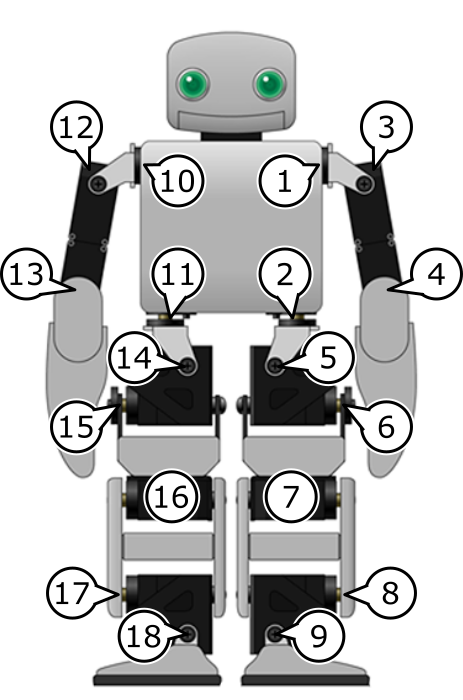

PLEN2 - 関節番号対応表
================================================================================

左右の区別はすべてPLENを背中側から見た際のものです。  
(回転軸は初期姿勢におけるものを記述しています。親部品が回転した場合、
相対的に子部品の回転軸も変化します。)

|名称      |ユーザ用番号|旧番号|新番号|回転軸(アロー表現)|
|:---------|:----------:|:----:|:----:|:----------------:|
|左肩ピッチ|1           |18    |0     |←                |
|左腿ヨー  |2           |12    |1     |↑                |
|左肩ロール|3           |19    |2     |×                |
|左肘ロール|4           |21    |3     |◎                |
|左腿ロール|5           |13    |4     |×                |
|左腿ピッチ|6           |14    |5     |←                |
|左膝ピッチ|7           |15    |6     |←                |
|左足ピッチ|8           |17    |7     |→                |
|左足ロール|9           |16    |8     |◎                |
|右肩ピッチ|10          |6     |12    |→                |
|右腿ヨー  |11          |0     |13    |↑                |
|右肩ロール|12          |7     |14    |×                |
|右肘ロール|13          |9     |15    |◎                |
|右腿ロール|14          |1     |16    |×                |
|右腿ピッチ|15          |2     |17    |→                |
|右膝ピッチ|16          |3     |18    |→                |
|右足ピッチ|17          |5     |19    |←                |
|右足ロール|18          |4     |20    |◎                |
